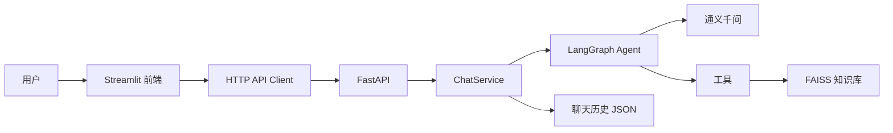

# RAG Knowledge Agent

一个可本地运行的企业知识库 Agent：使用 Streamlit 提供聊天界面，FastAPI 提供后端 API，LangGraph 管理工具调用流程，并通过 DashScope Embedding 与 FAISS 实现本地知识库检索。

## 功能

- 上传 PDF、TXT、DOCX 文档并建立向量索引
- 基于知识库内容回答问题并展示引用来源
- 使用 LangGraph 自动选择知识库、当前时间、计算器等工具
- 多会话聊天、历史记录持久化、会话清空与删除
- 知识库文件列表、重复文件检测和带回滚的安全删除
- 支持本地双进程运行和 Docker Compose 部署

## 架构



主要技术：Python 3.11、Streamlit、FastAPI、LangChain、LangGraph、DashScope、FAISS。

## 快速开始

### 1. 准备环境

需要：

- Python 3.11
- 一个有效的阿里云 DashScope API Key

Windows PowerShell：

```powershell
git clone <你的仓库地址>
cd RAG_project

python -m venv .venv
.\.venv\Scripts\python.exe -m pip install --upgrade pip
.\.venv\Scripts\python.exe -m pip install -r requirements.txt

Copy-Item .env.example .env
```

编辑 `.env`：

```dotenv
DASHSCOPE_API_KEY=replace-with-your-dashscope-api-key
API_BASE_URL=http://127.0.0.1:8000
```

不要提交 `.env`。项目只提交不含真实密钥的 `.env.example`。

### 2. 启动后端

```powershell
.\.venv\Scripts\python.exe -m uvicorn api.main:app --reload --port 8000
```

验证：

- 健康检查：<http://127.0.0.1:8000/health>
- Swagger 文档：<http://127.0.0.1:8000/docs>

### 3. 启动前端

另开一个 PowerShell：

```powershell
cd RAG_project
.\.venv\Scripts\python.exe -m streamlit run app.py
```

访问 <http://127.0.0.1:8501>。

## Docker Compose

安装 Docker Desktop 后，在项目根目录运行：

```powershell
Copy-Item .env.example .env
# 编辑 .env 并填入 DASHSCOPE_API_KEY
docker compose up --build
```

停止服务：

```powershell
docker compose down
```

`./data` 会挂载到后端容器，重建容器不会自动丢失知识库和会话数据。

## API

| 方法 | 路径 | 作用 |
|---|---|---|
| `GET` | `/health` | 健康检查 |
| `POST` | `/chat` | 发送聊天问题 |
| `GET` | `/sessions` | 获取会话列表 |
| `GET` | `/sessions/{session_id}/messages` | 获取会话消息 |
| `DELETE` | `/sessions/{session_id}/messages` | 清空会话消息 |
| `DELETE` | `/sessions/{session_id}` | 删除整个会话 |
| `POST` | `/documents` | 上传知识库文件 |
| `GET` | `/documents` | 获取知识库文件列表 |
| `DELETE` | `/documents/{file_id}` | 删除知识库文件及向量 |

聊天请求示例：

```json
{
  "session_id": null,
  "question": "什么是车辆路径规划？"
}
```

## 数据目录

运行时会生成以下本地数据，它们均已被 Git 忽略：

```text
data/
├── chat_history.json    # 聊天记录
├── file_registry.json   # 文件登记信息
├── uploads/             # 用户上传的原始文件
├── faiss_db/            # FAISS 索引与 Document 存储
├── backups/             # 删除操作的临时备份
└── trash/               # 删除过程中的临时回收目录
```


## 测试

安装开发依赖：

```powershell
.\.venv\Scripts\python.exe -m pip install -r requirements-dev.txt
```

执行：

```powershell
.\.venv\Scripts\python.exe -m compileall -q app.py config.py agent api client rag service
.\.venv\Scripts\python.exe -m pytest
```

单元测试不会调用远程大模型；真实模型和知识库联调需要单独手动验证。


## 项目结构

```text
RAG_project/
├── agent/       # LangGraph 状态、节点和工具
├── api/         # FastAPI 应用、路由和 Pydantic Schema
├── client/      # 前端使用的 HTTP 客户端
├── rag/         # 文档加载、切分、Embedding、FAISS 和历史管理
├── service/     # 聊天业务编排
├── tests/       # 不访问远程模型的自动测试
├── app.py       # Streamlit 前端入口
├── config.py    # 本地路径和模型配置
└── docker-compose.yml
```

## 安全说明

- `.env`、`.evn`、聊天记录、上传文件和向量索引不会进入新提交。
- 如果 API Key 曾经提交到 Git 历史，仅添加 `.gitignore` 无法移除历史中的密钥；请立即轮换密钥并清理 Git 历史。
- 本项目没有用户鉴权，默认只适合本机或受信任网络。公开部署前应增加认证、上传大小限制、速率限制和 HTTPS。

更多信息见 [SECURITY.md](SECURITY.md)。

## 贡献

提交修改前请阅读 [CONTRIBUTING.md](CONTRIBUTING.md)。

## License

本项目采用 [MIT License](LICENSE)。
